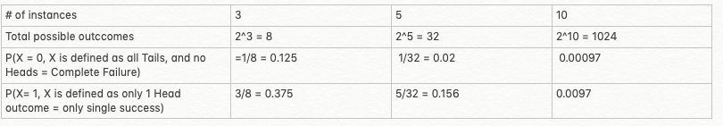

As logical beings we humans have an inherent tendency to constantly analyze our past data/experiences to find some **patterns** which will help us take better future decisions.This is a sort of defence endeavour by our minds , trying to inject some form of certainity in the empty unknowns of the future.

However we tend to have an inherent overconfidence in understanding and interpreting our data.This ability to apply past interpretations, which we sometimes term as **intuition**, is often limited by our experiences and thus at times can **hold us back**.Our past experiences(data bias) colour a lot of how we interact with future choices - limiting our ability to objectively evaluate and reflect on new experiences.We have an inherent shortcoming of being unable to predict our future because of the bias we hold from our past experiences.

We often overemphasize our ability to make life changing decisions. We mistake random events as consequences of our decisions and give ourselves too much credit for it when in reality it could simply be a **function of being at the right place at the right time**.In hindsight our current life is as much a **function of randomness** as it is of our intelligence, experience and emotion.Randomness is very important in our lives.Acknowleding this role of randomness helps us in the following ways -

- Makes it easier to realize that we have **limited insight on how our decisions play out** precisely in the future.
- Helps us **think more objectively about the decisions** without thinking too much about how they are going to play out in the future.
- Allows us to **think through the edge cases** of our decisions more clearly, thus preparing us better for the risk reward ratios that it may entail.
- Helps us think about the **downside risk** **of the decisions**, once you imagine them and accept them, taking risks becomes easier and more real.

After acknowledging and accepting the role of randomness we can start formalizing some new strategies to **bend the rules of this game in our favour**.Lets try to figure out some basics by trying to **simulate** a very basic form of this game of life.

## The coin toss experiment

All our decisions in life are evaluated majorly as either **a win** or **a loss,**  i.e. either the outcome of the decision is **favourable for us** or it is **detrimental for us**.This might be an oversimplification but it helps  us simulate an extremely simplified version of life as a coin toss experiment where each coin toss represents a risk/decision we have taken in life. The randomness in our lives can be represented by the respective probabilities of getting a **win i.e heads** or a **loss i.e tails**.Let us take 3 scenarios - one with **3** coin tosses, one with **5** coin tosses and one with **10** coin tosses(representing 3 different lives with 3, 5 and 10 risks/decisions taken)

2 positive things to be deduced from the coin toss experiment -

- The probability of absolute loss decreases as you increase the number of coin flips.What this means in life is that the more decisions/risks you take, the probability of a complete failure(i.e all your decisions resulting in a loss for you) reduces.
- Comparing the probability of winning atleast once , the odds stack up higher than the no-wins scenario of course owing to the condition that you know the probability of getting a single win(ie heads/tails).What this means in life is that the more decisions/risks you take, the chances of you getting a win increases faster than your chance of a complete failure.

What we can truly influence in life is to learn to play the game enough times. The more the number of times you flip the coin, the more you increase your chances of winning and you need to play only till you win.The more chances you take, the higher the probability of winning the game.

Now that we are ready to play the game enough times , we can use some real life tweaks to load the odds more in our favour on each risk/decision that we take.

## Concept of asymmetric bets

In the hypothetical experiment we conducted before we **generalized and simplified** quite a lot. One of the biggest generalisations was thinking that every decision/risk/bet we took (a coin flip in the experiment) had a 50:50 probability of a win or a loss.What this means is that in the scenario of a win the reward that we get would be equal in value to the penalty that we would face in the scenario of a loss.Such a bet would be called a **symmetric bet**.

However in life most of the bets are **asymmetric** in nature meaning that the values of the **reward** or **penalty** for our bets in disproportionate.These are known as **asymmetric bets** and can be characterized by 2 properties - 

- the downside risk (failure scenario)
- the upside risk (success scenario).

Hedging our bets would mean to pick bets where the upside risk (reward for win)  is high and the downside risk (penalty for loss) is minimum.Smart asymmetric bets generally have a tremendous upside if it works , and if it doesnt , it still generates a lot of **optionality.** Optionality is a concept which was advanced by **Nassim Taleb** in his book **Antifragile**. What it basically says is that when you do something which generates more options/opportunities for you , it is said to generate more optionality.The advantage of optionality is that as the world grows increasingly difficult to predict, you can thrive in spite of not knowing the future.You simply see what happens and exercise whichever option turns out to be most advantageous.

Asymmetric opportunities usually have meaningful upside in a success case, and meaningful learning or development in a downside case, bringing with it a lot of optionality. So if we treat a loss as just another point which is generating options for us , we can significantly cap the downside risk of the bets we took.

Armed with this knowledge if we are a bit judicious about how we play this game of life , we can significantly start reaping better rewards.Winning these asymmetric bets is all about the mindset

- Firstly we need to make peace with the fact that in life we don't need to win all the time or even many times, we need only a few wins.
- Secondly we need to understand that the more the number or decisions/risks that we take, the more we load the odds in our favour for getting those significant wins.
- Thirdly we need to take more asymmetric bets/risks which essentially curbs the need to keep playing this game forever.

Mind you these principles are easy to understand but harder to implement. As it is often said, winning is all about the mindset.We often dont want to take such risks or bets because we are afraid of the failure, we are afraid to look dumb even for a short period of time. At such times we should just remember -

- Years spent on failed bets are often forgotten when success comes along.
- If you are right in a bet then you win big if not then no one cares.
- You’re not known for your losses, you’re known for your wins.